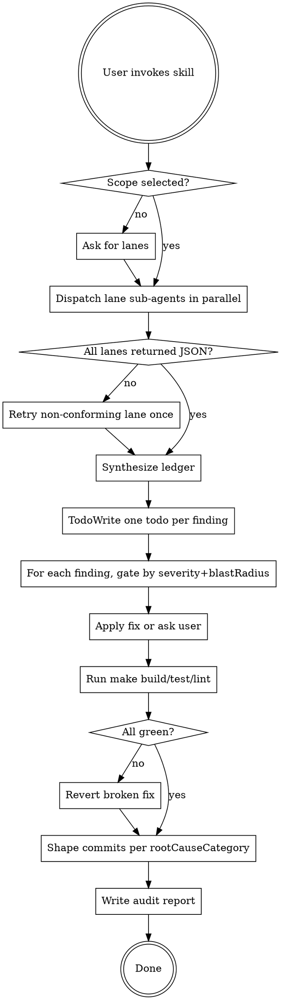

# audit-and-fix

Whole-codebase audit with autonomous fix. Formalises the weekly "ultrathink audit" ritual on Pull Request Pilot. Dispatches one sub-agent per lane in parallel, collects findings into a structured ledger, fixes in place, runs build/test/lint, and shapes commits by root cause.

## Core principle

**No finding silently drops.** The bug this skill prevents is the one the user hit repeatedly: Claude returning a prose audit, selectively acting on findings, and moving on. The JSON contract + TodoWrite ledger make omissions impossible.

## When to use

Triggers:
- "ultrathink" used as an imperative on the whole repo
- "analyze the whole code of the application"
- "fix all the findings" / "don't follow recommendation, fix all"
- "audit the repo" / "full codebase audit"
- User invokes `/audit-and-fix` explicitly

Do not use:
- Single-file or single-PR review → `superpowers:requesting-code-review`
- Pre-release compliance sweep → `/release-review`
- Reproducing a specific bug → `superpowers:systematic-debugging`

## Workflow



## Step 1 — Select scope

Default scope: all 8 lanes.

Explicit selector accepted: `lanes=domain,features,concurrency`.

Lanes (see `references/lane-definitions.md` for scope / non-scope per lane):

1. **domain** — `PullRequestPilot/Domain/Models/`
2. **features** — `PullRequestPilot/Features/**`
3. **infrastructure** — `PullRequestPilot/Infrastructure/**`
4. **tests** — `PullRequestPilotTests/**`
5. **concurrency** — cross-cutting: Sendable, actor isolation, cancellation, task lifecycle
6. **appstore** — sandbox, entitlements, privacy manifest, `metadata/appstore.yml`
7. **performance** — hot paths, startup, allocation pressure, auto-refresh cost
8. **ux** — error surfaces, empty states, accessibility labels, keyboard flow

## Step 2 — Dispatch in parallel

Send all lane sub-agents in a single message with multiple `Agent` tool calls. Use `general-purpose` unless a lane has a better-fitting subagent type.

Each sub-agent receives:
- Its lane definition (scope + non-scope) from `references/lane-definitions.md`
- The finding schema location: `references/finding-schema.json`
- The exact instruction: **return JSON matching the schema, nothing else. Empty array if nothing found.**
- Relevant CLAUDE.md sections as reminders of "what counts as a bug in this repo" (force-unwraps, `try?` swallows, `@unchecked Sendable`, pagination caps, `UserDefaults.standard` outside AppState, security-scoped bookmarks, forbidden subtitle terms).

## Step 3 — Validate each sub-agent response

For each returned payload:
- Parse as JSON. If it fails → retry the lane once with the prompt "Your previous response was not valid JSON. Return ONLY a JSON array matching the schema."
- Validate against `references/finding-schema.json` (required fields present, enums respected).
- If validation still fails after retry → surface to the user and exclude that lane from the ledger, but **note the failure explicitly in the report**.

## Step 4 — Synthesize the ledger

1. Concatenate all lane outputs into one array.
2. Deduplicate on `(file, lineRange, rootCauseCategory)` — keep the highest-severity entry.
3. Sort by severity descending (`critical` > `high` > `medium` > `low`), tie-break by `rootCauseCategory`.
4. Assign a sequential `id` (`FINDING-001`, `FINDING-002`, …).
5. Emit one `TaskCreate` todo per finding, title = `{id}: {title}` (severity). **Every finding becomes a todo. No exceptions.**

## Step 5 — Fix execution

Walk the ledger in order. For each finding:

| severity | blastRadius | action |
|----------|-------------|--------|
| low      | any         | apply fix + mark todo completed |
| medium   | any         | apply fix + mark todo completed |
| high     | small       | apply fix + mark todo completed |
| high     | medium/large/cross-cutting | pause, summarise, ask user |
| critical | any         | pause, summarise, ask user |

If a user-gated finding is deferred, mark the todo as `deferred` in the report (not completed), so the next audit re-surfaces it.

Never silently skip. "I don't know how to fix this" → ask the user, don't drop it.

## Step 6 — Verification

After all eligible fixes applied, run in order:

1. `make lint` — must pass `--strict` (project Makefile runs strict by default).
2. `make build` — zero warnings, zero errors.
3. `make test` — all green.

If any gate fails:
- Identify which fix caused the regression (git diff per fix; bisect if needed).
- Revert that specific fix; mark its todo as `reverted — <reason>` in the report.
- Re-run gates. Loop until green.

Do not commit until all three gates pass.

## Step 7 — Commit shaping

Split the working-tree diff into one commit per `rootCauseCategory`.

Prefixes (mirror existing repo commit style):
- `Fix: <category> — <short description>`
- `Refactor: <category> — <short description>`
- `Add: <category> — <short description>` (new tests, new guards)
- `Update: <category> — <short description>`

Use `git add -p` at file granularity where each file belongs cleanly to one category. When a single file spans categories, stage with explicit hunk selection; if that becomes ambiguous, fall back to one consolidated commit and flag it in the report.

Each commit message body includes the finding IDs it closes:

```
Fix: Concurrency — rethrow CancellationError in network layer

Closes FINDING-004, FINDING-007.
```

## Step 8 — Write the report

Path: `todo/audits/AUDIT-YYYY-MM-DD.md` (use today's date).

Template:

```markdown
# Audit — YYYY-MM-DD

## Summary

- Lanes run: {list}
- Findings total: N
- Fixed: M  |  Deferred: K  |  Reverted: R  |  Rejected: X
- Build: ✅ / ❌   Tests: ✅ / ❌   Lint: ✅ / ❌

## Ledger

| id | severity | category | file | title | outcome |
|----|----------|----------|------|-------|---------|
| FINDING-001 | high | concurrency | … | … | fixed |
| … |

## Deferred (needs user decision)

- FINDING-012 (critical, cross-cutting): <title> — why escalated.

## Lane failures (if any)

- lane=performance returned invalid JSON twice. Re-run manually.

## Commits

- `<sha>` Fix: Concurrency — …
- `<sha>` Refactor: Features — …
```

## Rationalisation table — if you think any of this, stop

| Thought | Reality |
|---------|---------|
| "Only a few findings really matter, I'll skip the rest" | That's the exact bug this skill exists to prevent. Every finding → todo. |
| "I'll return prose instead of JSON, the schema is overkill" | Prose makes findings droppable. JSON is the contract. |
| "The user probably wants me to ask about each one" | Default is fix-mode. Only `high + non-small blast` or `critical` escalate. |
| "I can skip the verification, the fix is obvious" | Every lane had a shipped-bug category. Build/test/lint gate catches regressions. |
| "One big commit is simpler" | Changelog breaks. One commit per rootCauseCategory, always. |
| "I'll skip the report file, the todos are enough" | Report is the durable artefact. Write it. |
| "Dry-run mode is safer" | Fix-mode is the default. Dry-run only if user explicitly requests it. |

## Red flags

If you notice any of these, stop and re-read this skill:

- About to summarise findings in prose instead of a JSON ledger.
- About to say "the most important ones are…" and skip the others.
- About to commit with a single `Bugfixes` message.
- About to claim the audit passed without running `make test`.
- About to skip writing the report file because "the user saw the todos".

## Out of scope

- Auto-writing tests for uncovered code (separate concern).
- Running on a cron (manual invocation only).
- Single-file reviews.
