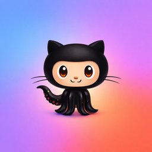
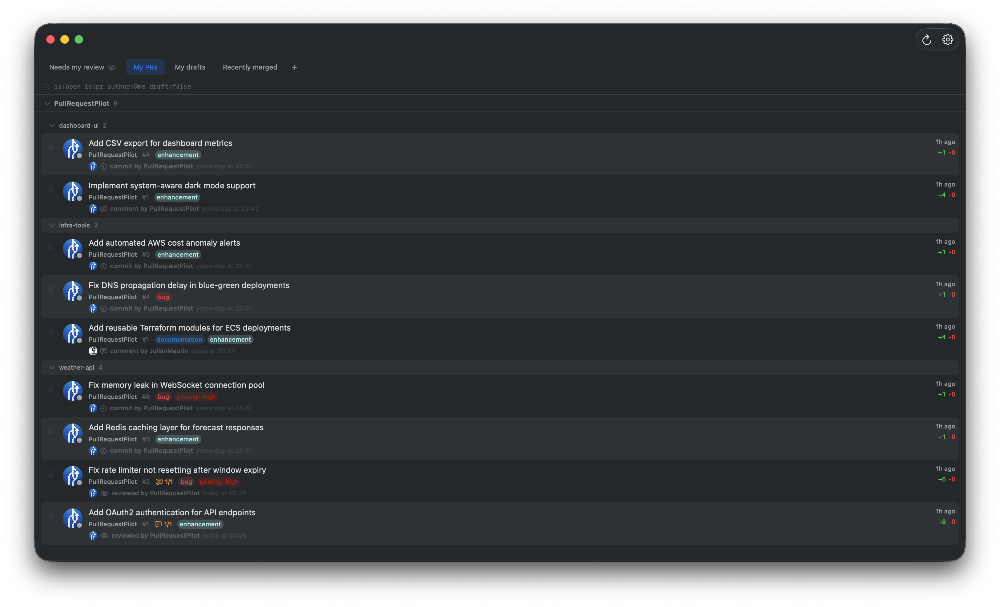
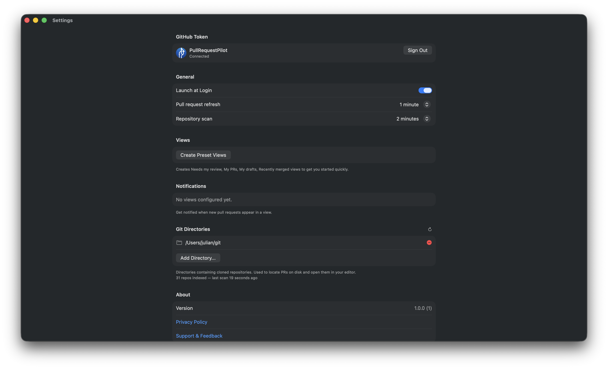
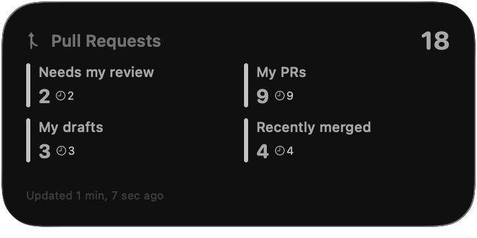
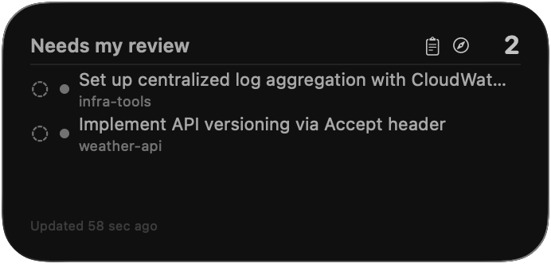

<p align="center">
  
</p>

<h1 align="center">Pull Request Pilot</h1>

<p align="center">
  A native macOS menu bar app to monitor your GitHub pull request review queues.<br>
  Built with SwiftUI. Zero external dependencies.
</p>

<p align="center">
  <a href="https://developer.apple.com/swift/"></a>
  <a href="https://developer.apple.com/macos/"></a>
</p>

---

<p align="center">
  
</p>

<p align="center">
  
</p>

<p align="center">
  
  &nbsp;&nbsp;
  
</p>

---

## Features

**Custom dashboard views** — Create filtered views using any GitHub search query (e.g., `is:pr is:open review-requested:@me`). Switch between views with tabs. Edit queries inline. Drag to reorder.

**Rich PR display** — Each pull request shows author avatar, review status, CI checks, unresolved comment threads, labels, last activity, diff stats, and age. PRs are grouped by organization and repository with collapsible sections.

**PR stack detection** — Automatically identifies stacked PRs (where one PR's base branch is another PR's head) and displays them as expandable chains with visual indicators.

**Local repository integration** — Point the app at directories containing your git repos. It indexes branches, worktrees, and recent commits in the background. Right-click any PR to:
- **Open in VS Code** — jump straight to the matching local directory
- **Open in iTerm** — open a new tab, `cd`'d to the repo

Matching priority: exact branch name > worktree branch > commit SHA.

**Notifications** — Enable per-view notifications to get alerted when new PRs appear. Shows PR title, repo, and number — or a summary when multiple arrive at once.

**macOS widgets** — Two widget types, each in small/medium/large:
- **Overview widget** — total PR count across all views with per-view breakdown
- **View detail widget** — configurable to a specific view, shows PR list with review status and direct links

**Menu bar app** — Lives in your status bar. Single-click for a quick view list with PR counts. Double-click to open the main window. Closing the window hides it — the app keeps running.

**Preset views** — One-click creation of common views: "Needs my review", "My PRs", "My drafts", "Recently merged".

**Launch at Login** — Optional toggle in Settings.

**Auto-refresh** — Configurable intervals for PR data (default 1 min) and local repo scanning (default 2 min).

## Requirements

- macOS 14 (Sonoma) or later
- A GitHub Personal Access Token with the `repo` scope — [create one here](https://github.com/settings/tokens)

### Build requirements

- Xcode 16+
- [XcodeGen](https://github.com/yonaskolb/XcodeGen) 2.38+

## Getting started

```bash
git clone https://github.com/JulianMaurin/pull-request-pilot.git
cd PullRequestPilot
make build
make run
```

On first launch, go to Settings and paste your GitHub token. Click **Save & Validate**.

### Development

Create a `.env` file at the project root:

```
GITHUB_TOKEN=ghp_your_token_here
```

Then:

```bash
make debug    # Debug build + run (reads token from .env)
```

## Build commands

```bash
make build        # Regenerate xcodeproj + Release build
make debug        # Debug build + run (sources .env)
make run          # Release build + run
make install      # Build + copy to /Applications
make uninstall    # Remove from /Applications
make test         # Run unit tests (235 tests)
make clean        # Clean build artifacts
```

## Architecture

MVVM + Clean Architecture with strict layer boundaries. No external dependencies — pure Apple frameworks (SwiftUI, URLSession, Security, WidgetKit).

```
Domain/Models/        Pure data models
Features/             View + ViewModel pairs (isolated per feature)
Infrastructure/       GitHub API (GraphQL), Keychain, Persistence, Local repo scanning
App/                  Entry point, DI composition root (AppState)
Shared/               Cross-target constants and widget data models
```

**Swift 6** with `SWIFT_STRICT_CONCURRENCY: complete` — all concurrency warnings are errors.

**GitHub API** uses GraphQL for precise field selection and cursor-based pagination.

**Token storage** uses the macOS Keychain with an in-memory cache to avoid repeated permission prompts.

**Local repo indexing** runs off the main thread. Lookups at display time are pure in-memory with zero I/O.

## Privacy

Pull Request Pilot collects no user data. Your GitHub token is stored exclusively in the macOS Keychain and never leaves your machine. See the [privacy policy](https://julianmaurin.github.io/PullRequestPilot/privacy).

## License

All rights reserved. This source code is proprietary and not licensed for redistribution.
